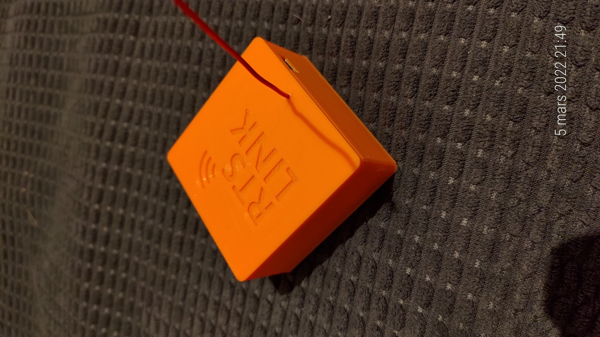

# RTS Link Hardware



USB transmitter for [RTS Link](https://github.com/kevin-briand/rts_link), the Home Assistant integration that controls Somfy RTS covers.

Based on the [SomfyRTS library](https://github.com/etimou/SomfyRTS) (Etienne Mouragnon, GPL v3), included in `rts_link/` with a few fixes.

## Bill of materials

- Arduino Nano (ATmega328P)
- RFM69HW radio module
- Level shifter 5 V ↔ 3.3 V (the RFM69 is a 3.3 V part)
- Antenna: a quarter-wave wire of about **17.3 cm** soldered on the ANT pin
- PCB (`PCB/`, DipTrace) and 3D printed case (`3D Print/`: box, lid, optional DIN rail support and lock)

## Wiring

Pins used by the firmware (through the level shifter):

| RFM69HW | Arduino Nano |
|---|---|
| NSS | D10 |
| MOSI | D11 |
| MISO | D12 |
| SCK | D13 |
| DIO2 (data) | D3 |
| 3.3 V / GND | 3.3 V / GND |

## Flashing the firmware

1. Open `rts_link/rts_link.ino` with the Arduino IDE, board **Arduino Nano** (ATmega328P).
2. Check the settings at the top of the file:
   - `#define DRY_RUN` must stay **commented out**, otherwise nothing is emitted on the radio.
   - `myRTS.setHighPower(true);` must stay **enabled** in `setup()`: the RFM69HW cannot emit without it.
3. Upload with a **regular USB upload**.
   - Do **not** use *Upload using programmer*: it erases the whole chip, including the EEPROM where the rolling codes are stored, and every cover would have to be paired again.
   - A regular upload keeps the EEPROM: paired covers keep working after a firmware update.

> On Linux, if the upload fails with `Permission denied` on `/dev/ttyUSB0`, add your user to the `dialout` group (`sudo usermod -aG dialout $USER`) and log in again.

> Close the sketch in the Arduino IDE and reopen it after pulling new files: an IDE left open may save its old copy over them.

## Checking the transmitter

Open the serial monitor at **115200 baud**, line ending **Newline**. At startup the transmitter prints:

```
Somfy RTS link
```

If `RADIO ERROR` is printed on the next line, the RFM69 does not answer: check the wiring and the 3.3 V supply. The other commands keep answering, but nothing is emitted.

Close the serial monitor before plugging the transmitter into Home Assistant: both programs would read the same port.

## Serial protocol

One command per line, terminated by `\n`, at 115200 baud.

| Command | Action | Answer |
|---|---|---|
| `PROG` | Creates a new virtual remote and sends its PROG frame | ID of the new remote |
| `MULTIPROG;<id>` | Sends a PROG frame with an existing remote (pair one more cover) | `<id>` |
| `UP;<id>` / `DOWN;<id>` / `STOP;<id>` | Sends the command with remote `<id>` | `OK` |
| `PING` | Checks that the transmitter answers | `OK` |
| `RESET` | **Factory reset**: forgets every remote and its rolling code. Every cover must be paired again | `OK` |
| anything else, unknown or invalid ID | — | `ERROR` |

Notes:
- Up to 255 remotes. The next free ID is stored in the last EEPROM byte, rolling codes use 2 bytes per remote from address 0.
- At least 1 s of silence is kept between two radio emissions (`MIN_GAP_MS`), so grouped commands are sent one cover after the other.

## Usage

1. Plug the transmitter into the Home Assistant host.
2. Install the [RTS Link integration](https://github.com/kevin-briand/rts_link) and select the transmitter USB port.
3. Pair your covers from the RTS Link panel.
